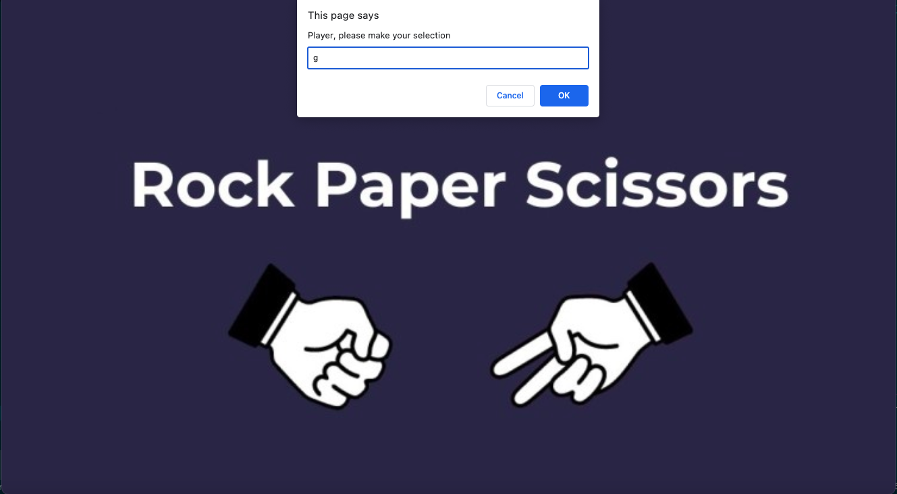
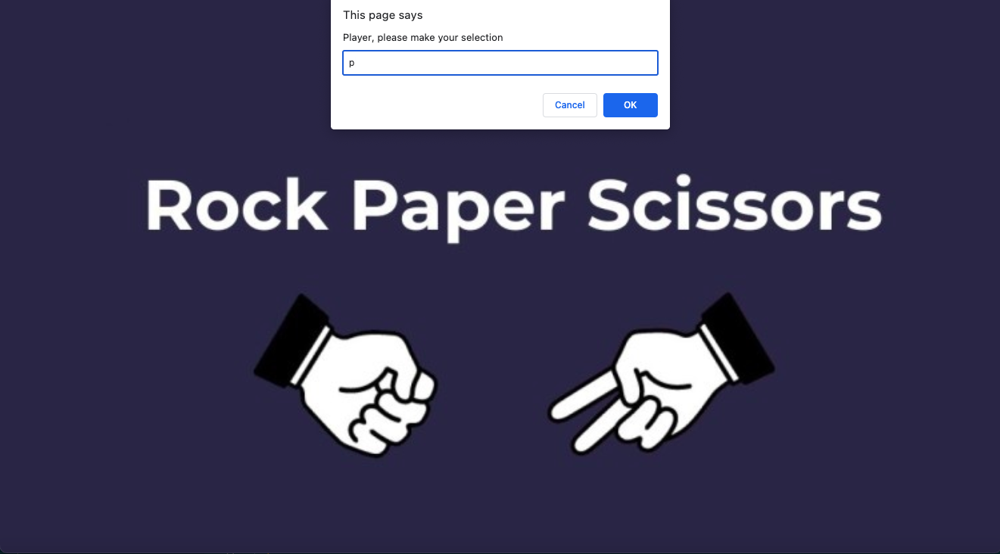
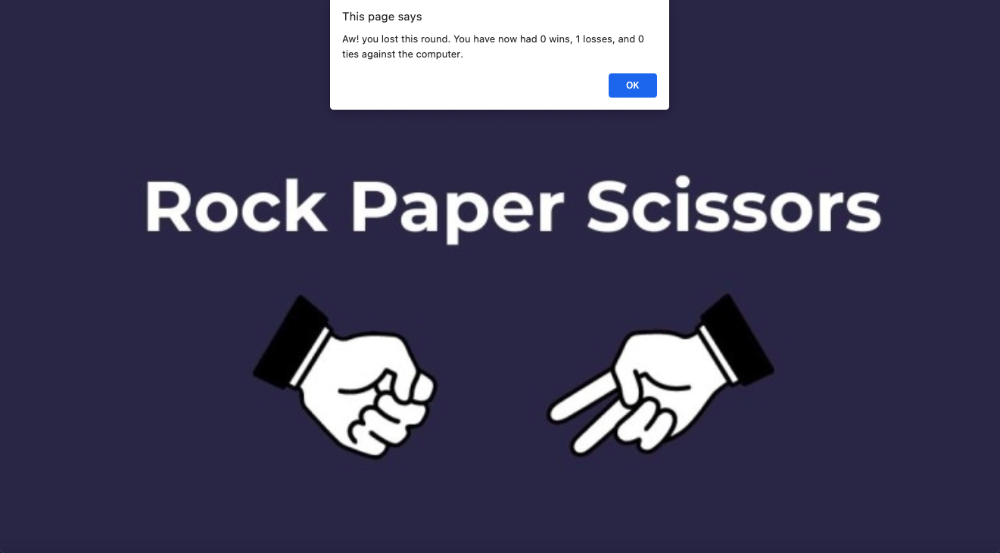
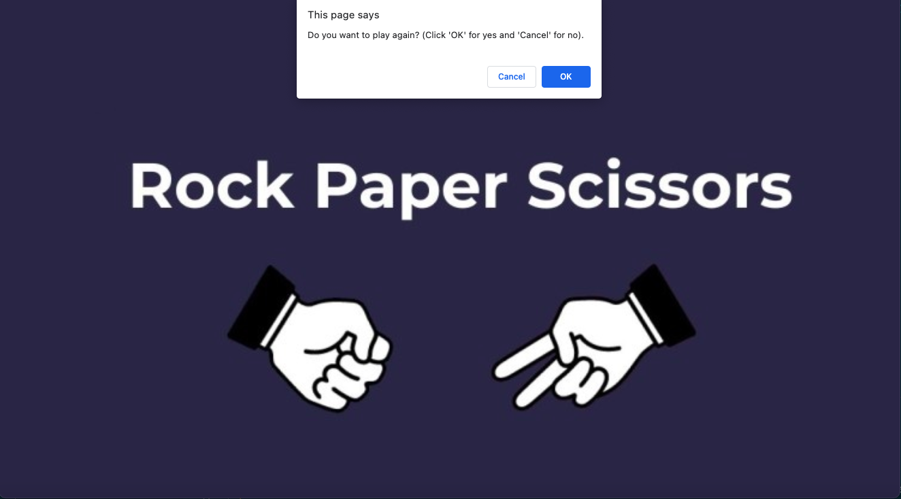
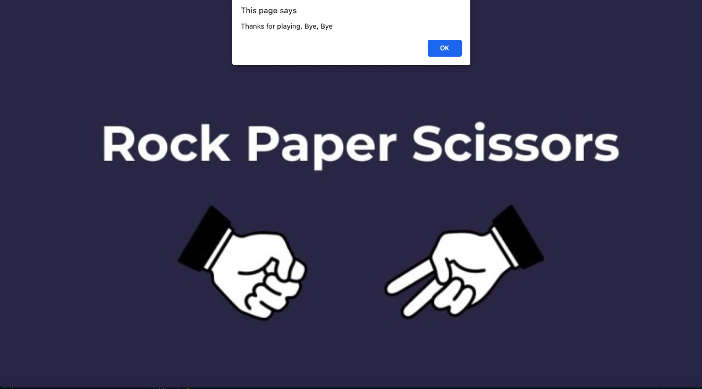
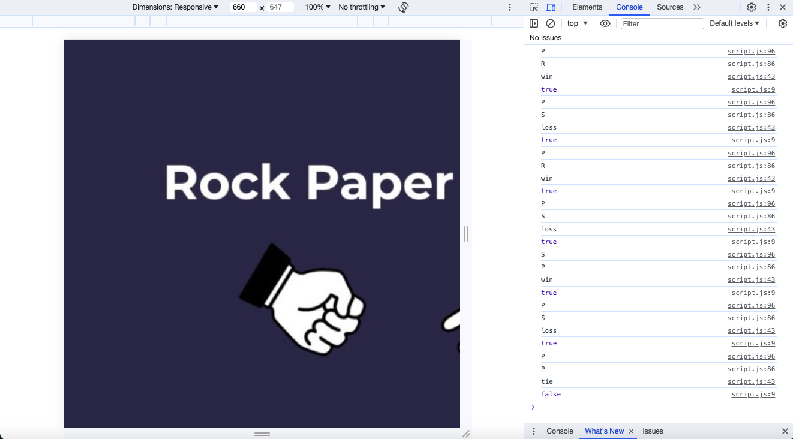

# rochambeau
A version of the classic game, Rock Paper Scissors, built solely with javaScript
 rochambeau

## Table of Contents
- [Description](#description)
- [Installation](#installation)
- [Usage](#usage)
- [Credits](#credits)
- [License](#license)
- [Contributions](#contributions)
- [Tests](#tests)
- [Questions](#questions)

## Description
A version of the classic game, Rock Paper Scissors, coded solely with javaScript. This game is an ideal candidate for conversation to a single player format with the computer as an opponent, because it involves both randomization and conditional logic: two things computers are good at. In each round of the game the player selects first from an array of three options, R, P or S, presented in a window prompt.  The computer makes a random selection from the same array.  Then the player's selection must be compared with the computer's selection.  According to the rules of the game where rock smashes scissors but is vulnerable to paper, which can cover it, where scissors cut paper but are vulnerable to rock which can smash them, and where paper can defeat rock by covering it but is vulnerable to scissors,there are three possible win scenarios, three possible loss scenarios and three scenarios where the player and computer make the same selection, resulting in a tie. The computer can quickly evaluate each case and increment the wins, losses or ties for a running tally in back-to-back games.In this game the computer's selection and the result of each round together with the total wins/losses/ties tally is communicated to the player by way of an alert. Then the user is presented with a confirm dialog box where are options are play another round or quit the game. The program contains a validation check for player input. Fun fact: this game originated in China in the 1600s from where it spread to Japan and thence to the US in the 1930s.  The alternative name Rochambeau (or Roshambo) was first used in California in 1936 and may be a corruption of the Japanese name Jon Ken Pon rather than a reference to the Comte de Rochambeau who was an ally of the Americans against the British in the Revolutionary War, who seems to have no connection with the game (source: https://www.mentalfloss.com/article/80201/why-do-people-call-rock-paper-scissors-roshambo). 

The user interface is very minimalist, cosmetically speaking, for this application. I wanted to exhibit what javaScript can do entirely on its own. The most challenging parts of development were handling the case of an invalid input, which involved a recursive function, and coding for the play again feature. The use of a recursive function without its own return originally led to a bug where I could not capture the value of the user input correctly in a case where the first input was invalid. Therefore I could not pass it correctly to the function that generated the game result and the computer assessed the round as a tie, even when the player and computer had made different selections. It was difficult to know how to call the functions for a 2nd-nth round of play in a way that didn't interfere with the initial round. Eventually I solved this by encapsulating the whole game "recipe" consisting of four method steps, in a playGame function which could be called both upon page load and each time the player's response to the play again query evaluated to true. I wanted a minimalistic HTML file, but thought it wouldn't hurt to spread a cover image over the whole background. Mysteriously the image does not display until after the program script has been concluded, even though the placement of the script link in the html is at the end of the body.  In future it might be cool to  add an image of the player's chosen hand formation coming in from the left side of the screen and the computer's "hand" coming in from the right. This would be easy enough to do with javaScript conditional logic and CSS display: none rules.

[Deployed Application](Follow the link to the deployed application to play the game for yourself: kwubbenhorst.github.io/rochambeau)

## Installation
N/A

## Usage
See the following screenshots for an illustration of the functionality

## Credits
This project was a single-author creation.

## License
This project is licensed under the [MIT License](./LICENSE-MIT).

## Contributions
If you would like to contribute to this project please contact me directly: Karla Wubbenhorst kwubbenhorst@gmail.com

## Tests
N/A

## Questions
If you have any questions you can also contact me at the email given above.
